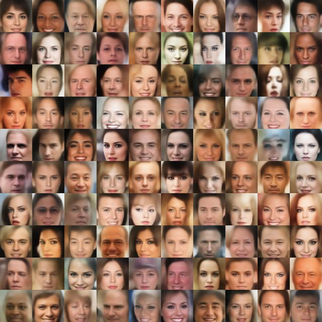
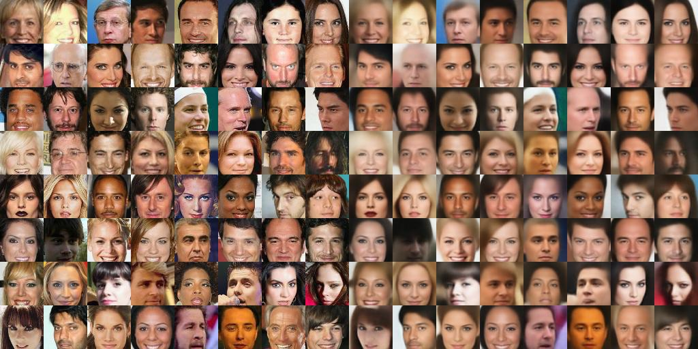
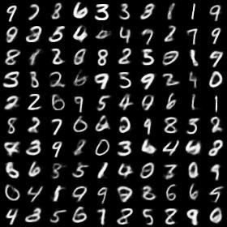
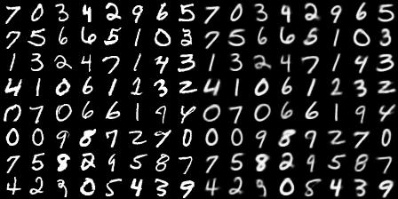

# GANs

Tensorflow implementation of VAE.

VAE: [Auto-encoding variational bayes](http://arxiv.org/abs/1312.6114) 

## Exemplar results

### Celeba
Generation



Reconstruction



### Mnist
Generation



Reconstruction



# Prerequisites
- tensorflow r1.2
- python 2.7

# Usage

## Train
```
python train_celeba_vae.py
python train_mnist_vae.py
```
## Tensorboard
```
tensorboard --logdir=./summaries/celeba --port=6006
...
```

## Datasets
1. Mnist will be automatically downloaded
2. Celeba should be prepared by yourself in ./data/img_align_celeba
    - Download the dataset: https://www.dropbox.com/sh/8oqt9vytwxb3s4r/AAB06FXaQRUNtjW9ntaoPGvCa?dl=0