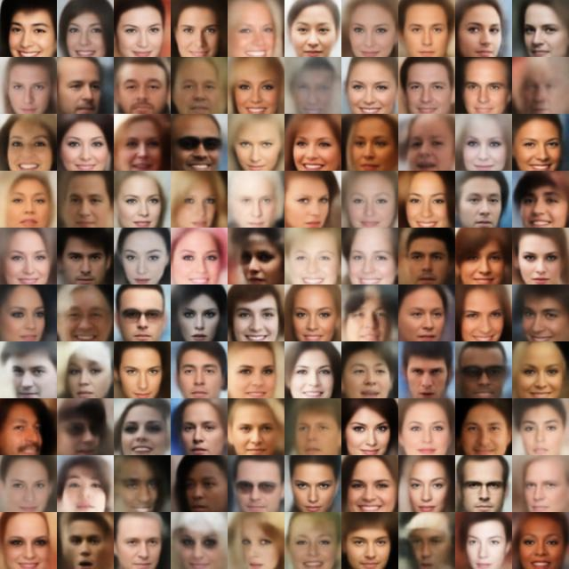
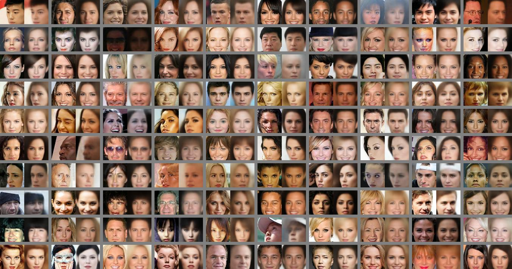
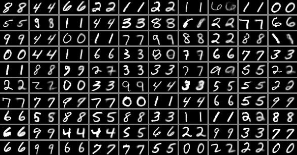
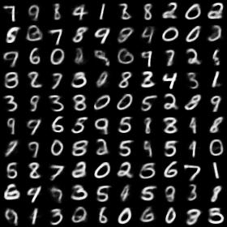
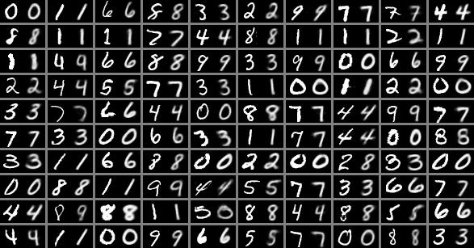

# <p align="center"> (beta-)VAE </p>

Tensorflow implementation of [VAE](http://arxiv.org/abs/1312.6114) and [beta-VAE](https://openreview.net/pdf?id=Sy2fzU9gl)

## Exemplar results

- Celeba

    - ConvNet (z_dim: 100, beta: 0.05)

        Generation                                                                          | Reconstruction
        :---:                                                                               | :---:
         | 

- Mnist

    - ConvNet (z_dim: 10, beta: 0.1)

        Generation                                                                    | Reconstruction
        :---:                                                                         | :---:
         | 

    - MLP (z_dim: 10, beta: 0.1)

        Generation                                                                   | Reconstruction
        :---:                                                                        | :---:
         | 

## Usage

- Prerequisites
    - Tensorflow 1.8
    - Python 2.7 or 3.6


- Examples of training

    ```console
    CUDA_VISIBLE_DEVICES=0 python train.py --z_dim 10 --beta 0.1 --dataset mnist --model mlp_mnist --experiment_name z10_beta0.1_mnist_mlp
    CUDA_VISIBLE_DEVICES=0 python train.py --z_dim 10 --beta 0.1 --dataset mnist --model conv_mnist --experiment_name z10_beta0.1_mnist_conv
    CUDA_VISIBLE_DEVICES=0 python train.py --z_dim 32 --beta 0.1 --dataset celeba --model conv_64 --experiment_name z32_beta0.1_celeba_conv
    ```

## Datasets

1. Celeba should be prepared by yourself in ***./data/celeba/img_align_celeba/*.jpg***
    - Download the dataset: https://www.dropbox.com/sh/8oqt9vytwxb3s4r/AAB06FXaQRUNtjW9ntaoPGvCa?dl=0
    - the above links might be inaccessible, the alternatives are
        - ***img_align_celeba.zip***
            - https://pan.baidu.com/s/1eSNpdRG#list/path=%2FCelebA%2FImg or
            - https://drive.google.com/drive/folders/0B7EVK8r0v71pTUZsaXdaSnZBZzg
2. Mnist will be automatically downloaded